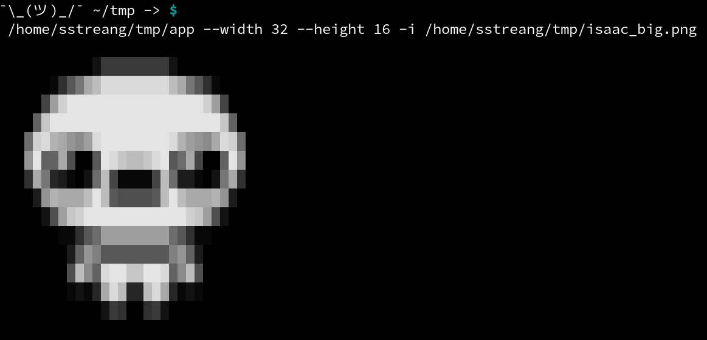

# Loki
A small program to display in the terminal window a gray scaled version
of an image.

I can't guarantee that it will be supported by all linux terminals
(was tested only on Terminator and the base terminal).




Usage:
```shell
loki [options]
    -h, --help             this message
    --width WIDTH          tells the width to be displayed
    --height HEIGHT        tells the height to be displayed
    -i PATH                the path to the image(lower resolution the better)
    --specs                display the specs
```